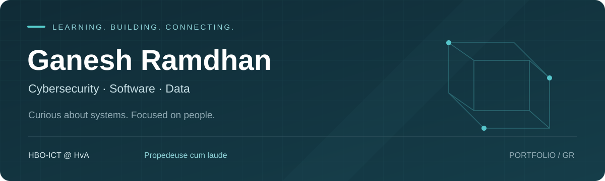

  

  <strong>HBO-ICT student · Business Intelligence · Development · Cybersecurity</strong> 
  Amstelveen / Amsterdam · Available 16–24 hours per week, with room to discuss more

  <a href="#selected-projects">Selected projects</a> &nbsp; / &nbsp;
  <a href="#study--technical-foundation">Study & skills</a> &nbsp; / &nbsp;
  <a href="#lets-connect">Let's connect</a>

---

### Hi, I'm Ganesh

I like understanding how things work and helping people move forward. That curiosity took me from customer-facing roles to **Front-end Development at Winc Academy** and **HBO-ICT at the Hogeschool van Amsterdam**, where I chose **Cyber Security** and completed my propedeuse **cum laude in 2026**.

At **APG**, I work as a **Pensioenexpert KCC**, translating complex pension questions into clear explanations. In my studies and personal projects, I bring that same care to software, data and secure systems.

**Open to junior roles in Business Intelligence, software development or cybersecurity, and working-student opportunities in IT.**

## Selected projects

<table>
<tr>
<td width="50%" valign="top">
<h3>01 / Security & infrastructure</h3>
<h4><a href="https://github.com/GRamdhan/homelab">Raspberry Pi Home Lab ↗</a></h4>

A personal lab for Linux administration, network security and service monitoring, with configuration examples and an incident write-up.

<code>Linux</code> <code>Docker</code> <code>SSH</code> <code>DNS</code>

<a href="https://github.com/GRamdhan/homelab/blob/main/docs/incidents/INC-001-pihole-allowlist.md">Read the incident write-up →</a>

</td>
<td width="50%" valign="top">
<h3>02 / Application development</h3>
<h4><a href="https://github.com/GRamdhan/DTT_Assessment">DTT House Listings ↗</a></h4>

A house-listing application built for a front-end assessment. Explore the Vue application, REST API integration and lessons about API-key handling.

<code>Vue 3</code> <code>Vuex</code> <code>REST API</code>

<a href="https://github.com/GRamdhan/DTT_Assessment#readme">Explore the project →</a>

</td>
</tr>
<tr>
<td width="50%" valign="top">
<h3>03 / React & API integration</h3>
<h4><a href="https://github.com/GRamdhan/Eindopdracht-JS-advanced">Events App ↗</a></h4>

Advanced JavaScript coursework: an events interface using React and a mock REST backend. The README documents features and known limitations.

<code>React</code> <code>Chakra UI</code> <code>JSON Server</code>

<a href="https://github.com/GRamdhan/Eindopdracht-JS-advanced#readme">Explore the project →</a>

</td>
<td width="50%" valign="top">
<h3>04 / Components & state</h3>
<h4><a href="https://github.com/GRamdhan/Eindopdracht-JS-basisc">Recipe Browser ↗</a></h4>

A React coursework project with recipe search, dietary labels and detail views. Built around reusable components, props and state.

<code>React</code> <code>JavaScript</code> <code>Chakra UI</code>

<a href="https://github.com/GRamdhan/Eindopdracht-JS-basisc#readme">Explore the project →</a>

</td>
</tr>
</table>

<strong>Earlier work · HTML & CSS foundations</strong>

 

[**Organic Coffee**](https://github.com/GRamdhan/Winc-Academy_Front-end_Hackathon) — a multi-page website for a fictional coffee brand, built during a Winc Academy hackathon with HTML and CSS.

## Data & Business Intelligence

My HvA coursework also includes two data-focused projects:

- **WannaBike BI** — SQL databases, Power BI dashboards and DAX calculations addressing eleven user stories.
- **Airbnb analysis** — data cleaning, analysis and visualisation with Python, pandas and seaborn in Jupyter, translated into advice.

These projects form part of my study experience. Their source files are not yet published in this portfolio.

## Study & technical foundation

| Area | Applied in my studies and projects |
| :--- | :--- |
| **Security & systems** | Linux, Raspberry Pi, networking, OWASP / ASVS; SSH hardening, Fail2ban, Pi-hole and Docker in my home lab |
| **Software development** | HTML, CSS, JavaScript, React, Vue, Python, Git and GitLab |
| **Data & business intelligence** | SQL, Power BI, DAX, Python, pandas, seaborn and Jupyter |
| **Analysis & collaboration** | ITIL Foundation certification; customer communication at APG; Scrum Master responsibilities in a study project |

<strong>Explore my HvA study projects</strong>

 

- **Web development & Secure App** — front-end and back-end development including Python, security advice using ASVS, and planning and task coordination as Scrum Master.
- **Linux, networks & AI** — a Raspberry Pi network with a web server, database, DNS and a local AI server.
- **Business Intelligence** — SQL databases, Power BI dashboards and DAX calculations addressing eleven WannaBike user stories.
- **Airbnb data analysis** — cleaning, analysing and visualising data in a Jupyter notebook with Python, pandas and seaborn, then translating the findings into advice.

These projects describe my study experience; their source files are not currently included in this public GitHub portfolio.

### What I'm exploring next

Centralised logging and incident response, WireGuard remote access, and self-hosted password management. Follow the [home lab roadmap](https://github.com/GRamdhan/homelab#roadmap) for completed and planned work.

## Let's connect

Interested in someone who combines **technical curiosity, careful analysis and clear communication**? I'm looking to put my HBO-ICT studies into practice in a team where I can contribute and keep learning.

**Languages:** Dutch (native) · English (fluent) · French (basic)

Built through study, practical projects and a continuing curiosity about how systems work.

